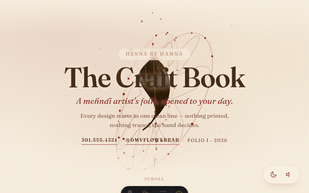

# hamna-Henna-Site

Immersive 3D portfolio for a henna artist — built with Astro, React Three Fiber, and Web Audio.



## Live preview

- **GitHub Pages:** https://lianbeast.github.io/hamna-Henna-Site/

## Features

- 🪷 Interactive 3D henna scene — mandala rings, paisley form, floating particles, mouse-reactive camera
- 🌙 Dark mode with neon wireframe edges and glow sparks
- 🎵 Web Audio tanpura drone (toggle in the floating toolbar)
- ✨ Scroll-driven animations — staggered section reveals, mandala acceleration, camera pull-back
- 🧊 Glassmorphism depth cards throughout

## Local dev

```bash
cd site
pnpm install
pnpm dev
```
